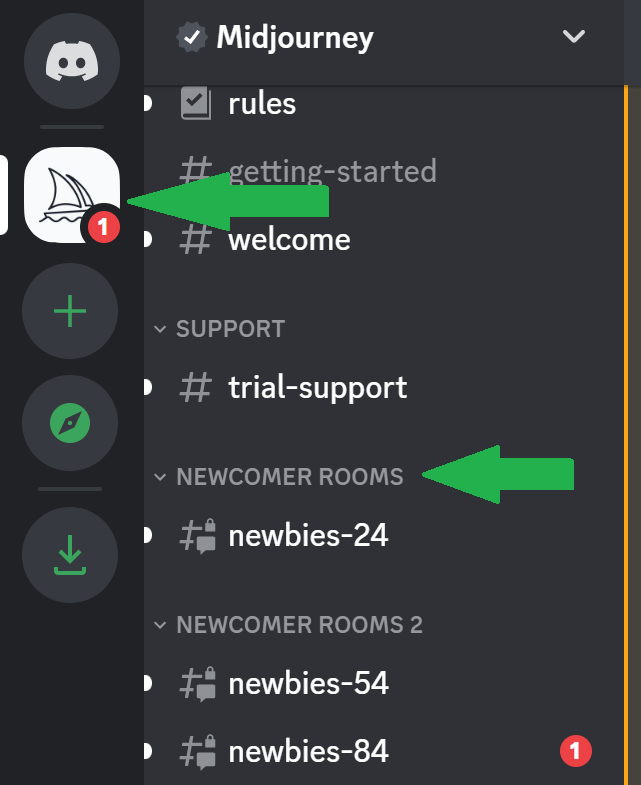
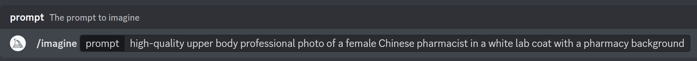
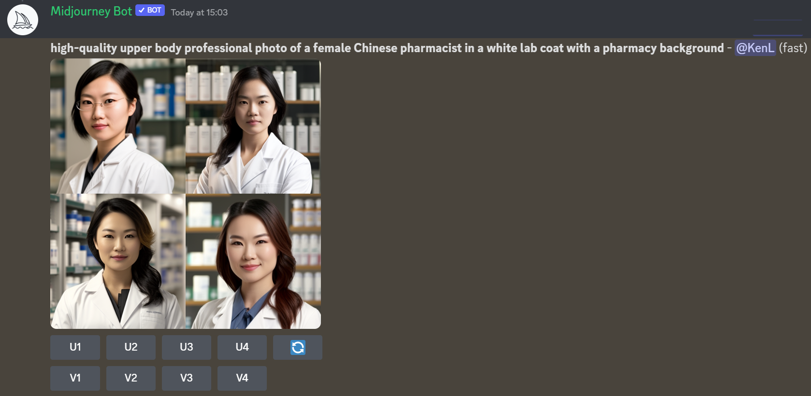
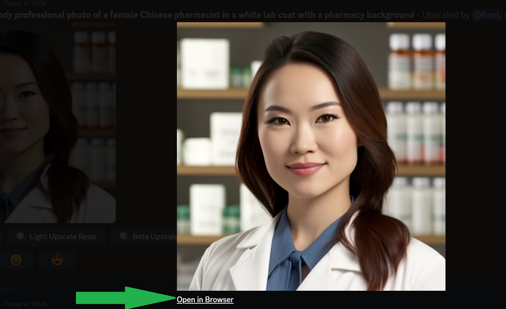
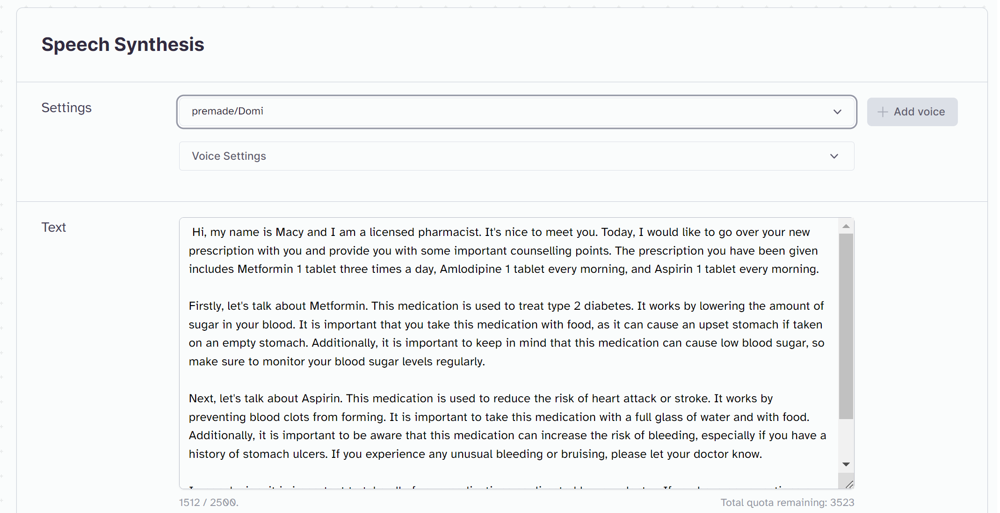
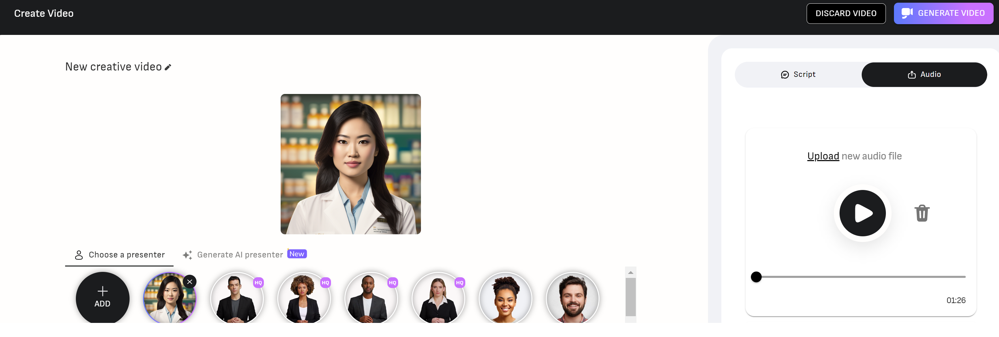

# Generative AI Pharmacist

## Presenting to you, **Macy the AI Pharmacist**! 

Keen to put the latest generative AI tools to the test, I created this animated avatar capable of delivering medication counselling in a realistic and professional-sounding manner.

> :warning: Disclaimer: This video is purely for demo purposes as part of a personal hobby project and is not intended to provide any form of medical advice. This is not a real product, and views expressed are my own.

Click the thumbnail below (or [visit this link](https://www.youtube.com/watch?v=RXjTK05U2Ag)) to watch the demo video to see Macy in action, where she briefly talks about two commonly-prescribed medications. 

The outcome is pretty impressive and will only get better over time, given the speed at which generative AI is improving. To create this demo, it took me 0 dollars and only 25 minutes.

Here are the tools I used:
1. [**Midjourney**](https://midjourney.com/home/?callbackUrl=%2Fapp%2F) to generate an image of a female pharmacist
2. OpenAI's [**ChatGPT**](https://chat.openai.com/chat) to generate script for medication counselling
3. [**ElevenLabs**](http://www.elevenlabs.io/)'s Prime Video AI to generate audio from the ChatGPT script
4. [**D-ID**](https://www.d-id.com/)'s Creative Reality Studio to generate realistic animated avatar video synced with audio (Free trial)

#### This demo is inspired by [Prompt Engineering](https://www.youtube.com/watch?v=V2efVSXSlqc)
___
 

## Step-by-Step Guide

### (1) Midjourney - Image Generation
- We need a face to represent our avatar, and we can use image generation tools like Midjourney to do just that
- Midjourney is a free AI service by OpenAI that creates images from textual descriptions
- Setup:
    1. Midjourney works entirely on Discord, so make sure you sign up for a Discord account (which is free).
    2. Visit this Midjourney site [link](https://discord.gg/midjourney), which automatically takes you to a Discord invite.
    3. Accept the Discord invite to Midjourney. Choose to Continue to Discord.
    4. Click on the Midjourney  button (with the ship icon) and select any of the Newcomer rooms e.g., `newbies-24`

    

    
    

    5. In the chat line, type  `/imagine` followed by your description prompt. For example, the prompt I used was "high-quality upper body professional photo of a female Chinese pharmacist in a white lab coat with a pharmacy background". Press Enter after typing it in, and give Midjourney some time to generate the images.  

    

      
    

    6. Once done, you will see an output of four images. Below the image set, you will see a set of buttons U1-U4, and V1-V4.

    

      
    

    7. The four images are numbered going clockwise from the upper left. To get a new variation of a particular image you like, select "V1" (or V2, V3, or V4), and to get a high resolution copy, select "U1" (or U2, U3, or U4)
    8. Once you have your selected high-resolution variant by clicking one of the U buttons, click on the image and then click the 'Open in Browser' link near the bottom. You can then right click and save the high resolution image into your computer.

    

     
    

> I also tried other tools like DALL-E and Stable Diffusion but their results were not realistic enough (e.g., misaligned eyes and facial features).

**NOTE**: Midjourney has paused its free trial program as of April 2023. To generate realistic facial pictures, you can use either of the following:
- Find a picture on the Internet as the base image to work with, or even use your own photos
- Head to https://this-person-does-not-exist.com/en (based on the StyleGAN algorithm) to generate a realistic face
- Other websites that you can try include: https://lexica.art and https://playgroundai.com/

 

### (2) ChatGPT - Text Generation
- We need a counselling script that can give relevant advice on a set of medications. To do that, we can use ChatGPT.
- ChatGPT is a chatbot developed by OpenAI and launched in November 2022. It is built on top of OpenAI's GPT-3 family of large language models.
- Setup:
    1. Visit this [link](https://chat.openai.com/chat) to access ChatGPT (you will need to sign up and login accordingly, which is free)
    2. In the prompt section, enter the relevant description for the counselling script. For example, the prompt I used is as follows: "Create a script that first introduces oneself as a pharmacist called Macy, and then talks about the counselling points to a patient for the following prescription: metformin 1 tablet 3 times a day, amlodipine 1 tablet every morning, and aspirin 1 tablet every morning".

    

    
    

    3. From the output on the ChatGPT screen, copy and save the generated text in a text file on your local machine.
> I had to regenerate the response several times because I found some of the output to be overly theoretical and academic, and is not in the expected layman format for explaining medications to patients.

 

### (3) ElevenLabs - Text-to-Speech Generation
- Next, we want to convert the ChatGPT script text into a natural sounding audio clip. We can do so with free tools like Prime Voice AI (by ElevenLabs)
- Prime Voice AI is a realistic and versatile AI speech software that brings the most compelling, rich and lifelike voices to creators and publishers seeking the ultimate tools for storytelling.
- Setup:
    1. Visit the [ElevenLabs page](https://beta.elevenlabs.io/) and create an account for free.
    2. On the Speech Synthesis page, select a specific voice in the settings, paste the text script into the text section, and click Generate. The voice I chose was `premade/Domi` as I found it to be the most lively and natural. The settings can also be adjusted accordingly for things like stability and clarity.

    

    
    

    > I shortened the script slightly by removing the section on the drug Amlodipine because I did not want the demo to be too long.

    3. There is a credit limit for the free account, so make sure you use them wisely for the audio you want to generate.

    4. Download and save the .mp3 (titled 'synthesized_audio.mp3') file on your local machine.

> Bonus Tip: ElevenLabs also comes with the voice cloning capabilities (under the Voice Lab feature): https://beta.elevenlabs.io/voice-lab. If you have >1 min recording of a particular voice, you can convert the script into the voice you want to clone.

 

### (4) D-ID - Photorealistic Talking Avatar (and Audio Sync) Generation
- Lastly, it is time to piece the pharmacist image and counselling audio together into a photorealistic video. To do so, we can use tools like D-ID.
- D-ID’s creative AI technology takes images of faces and turns them into high-quality, photorealistic videos. At the click of a button, it can combine images with audio or text to give them expression and speech.
- Setup:
    1. Visit the [D-ID](https://www.d-id.com/) website and create a Free Trial account
    2. Select the Create Video button to start creating a new video
    3. Add your Midjourney pharmacist image as a presenter image
    4. Upload our ChatGPT scripted audio in the `Upload your own voice` section on the right.

    

    
    

    

    5. Click the `Generate Video` button at the top right and wait for your masterpiece to be ready for download!

___

